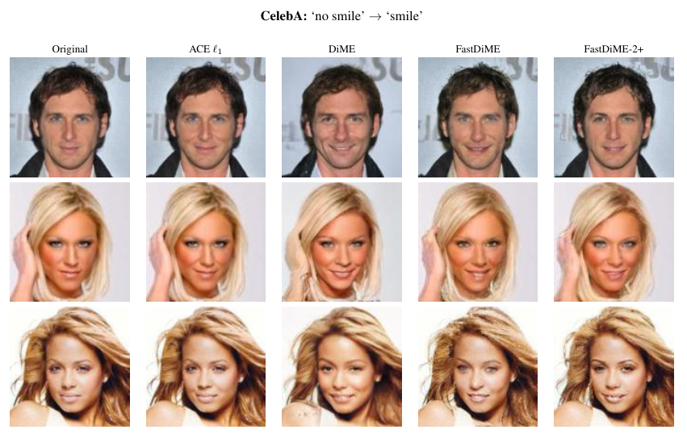
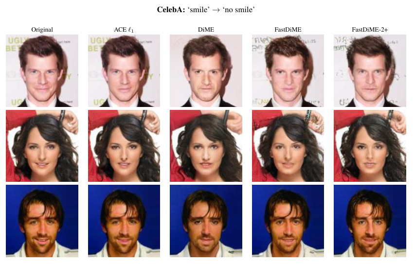

# Fast Diffusion-Based Counterfactuals for Shortcut Removal and Generation (ECCV 2024 ORAL)

Official FastDiME Pytorch implementation for our experiments on the [CelebA](https://mmlab.ie.cuhk.edu.hk/projects/CelebA.html) benchmark

[Nina Weng*](https://scholar.google.com/citations?user=Os3OANQAAAAJ&hl=en), [Paraskevas Pegios*](https://scholar.google.com/citations?user=LVACmX4AAAAJ&hl=en&oi=ao), [Eike Petersen](https://scholar.google.com/citations?user=juRQtRgAAAAJ&hl=en), [Aasa Feragen](https://scholar.google.com/citations?user=MNDVpoUAAAAJ&hl=en&oi=ao), [Siavash Bigdeli](https://scholar.google.com/citations?user=NhEK9voAAAAJ&hl=en)

[[ECCV 2024 ORAL - Preprint Paper]](https://arxiv.org/abs/2312.14223)
[[Project page: fastdime.compute.dtu.dk]](https://fastdime.compute.dtu.dk/)






## Abstract

Shortcut learning is when a model -- e.g. a cardiac disease classifier -- exploits correlations between the target label and a spurious shortcut feature, e.g. a pacemaker, to predict the target label based on the shortcut rather than real discriminative features. This is common in medical imaging, where treatment and clinical annotations correlate with disease labels, making them easy shortcuts to predict disease. We propose a novel detection and quantification of the impact of potential shortcut features via a fast diffusion-based counterfactual image generation that can synthetically remove or add shortcuts. Via a novel self-optimized masking scheme we spatially limit the changes made with no extra inference step, encouraging the removal of spatially constrained shortcut features while ensuring that the shortcut-free counterfactuals preserve their remaining image features to a high degree. Using these, we assess how shortcut features influence model predictions. This is enabled by our second contribution: An efficient diffusion-based counterfactual explanation method with significant inference speed-up at comparable image quality as state-of-the-art. We confirm this on two large chest X-ray datasets, a skin lesion dataset, and CelebA. 

## Citation

If you found useful our code, please cite our work.

```bibtex
@article{weng2023fast,
        title={Fast diffusion-based counterfactuals for shortcut removal and generation},
        author={Weng, Nina and Pegios, Paraskevas and Feragen, Aasa and Petersen, Eike and Bigdeli, Siavash},
        journal={arXiv preprint arXiv:2312.14223},
        year={2023}
      }      
``` 


## FastDiME for Counterfactual Explanations

Pytroch implementation for FastDiME can be found in core/sample_utils.py

```python

@torch.no_grad()
def generate_mask(x1, x2, dilation):
    '''
    Extracts a mask by binarizing the difference between 
    denoised image at time-step t and original input.
    We generate the mask similar to ACE.

    :x1: denoised image at time-step t
    :x2: original input image
    :dilation: dilation parameters
    '''
    assert (dilation % 2) == 1, 'dilation must be an odd number'
    x1 = (x1 + 1) / 2
    x2 = (x2 + 1) / 2
    mask =  (x1 - x2).abs().sum(dim=1, keepdim=True)
    mask = mask / mask.view(mask.size(0), -1).max(dim=1)[0].view(-1, 1, 1, 1)
    dil_mask = F.max_pool2d(mask, dilation, stride=1, padding=(dilation - 1) // 2)
    return mask, dil_mask

# =======================================================
# Sampling Function
# =======================================================
def get_FastDiME_iterative_sampling(use_sampling=False):
    '''
    Returns FastDiME's main algorithm to construct counterfactuals.
    The returned function computes the computes denoised x_t using Equation 4.
    FastDiME uses the denoised image to approximate the gradients for the input image and 
    avoids a heavy back propagation of GMD. The denoised image gradients act as a surrogate
    for the image gradients as they asymptotically reach the same image.

    Easy way to set the optional parameters into the sampling
    function such as the use_sampling flag.
    :param use_sampling: use mu + sigma * N(0,1) when computing
     the next iteration when estimating x_t
    '''
    @torch.no_grad()
    def p_sample_loop(diffusion,
                      model,
                      shape,
                      num_timesteps,
                      img,
                      t,
                      z_t=None,
                      clip_denoised=True,
                      model_kwargs=None,
                      device=None,
                      class_grad_fn=None,
                      class_grad_kwargs=None,
                      dist_grad_fn=None,
                      dist_grad_kargs=None,
                      x_t_sampling=True,
                      is_x_t_sampling=False,
                      guided_iterations=9999999,
                      scale_grads=False,
                      fast_dime_kwargs=None,
        ):
        '''
        :param :
        :param diffusion: diffusion algorithm
        :param model: DDPM model
        :param num_timesteps: tau, or the depth of the noise chain
        :param img: instance to be explained
        :param t: time variable
        :param z_t: noisy instance. If z_t is instantiated then the model
                    will denoise z_t
        :param clip_denoised: clip the noised data to [-1, 1]
        :param model_kwargs: useful when the model is conditioned
        :param device: torch device
        :param class_grad_fn: class function to compute the gradients of the classifier
                              has at least an input, x_t.
        :param class_grad_kwargs: Additional arguments for class_grad_fn
        :param dist_grad_fn: Similar as class_grad_fn, uses z_t, x_t, x_tau, and alpha_t as inputs
        :param dist_grad_kwargs: Additional args for dist_grad_fn
        :param x_t_sampling: use sampling when computing x_t
        :param is_x_t_sampling: useful flag to distinguish when x_t is been generated
        :param guided_iterations: Early stop the guided iterations
        :param scale_grads: scale grads based on time dependant constant
        :param dist_grad_kwargs: args for FastDiME algorithm
        '''

        boolmask = None
        x_t = img.clone()
        z_t = diffusion.q_sample(img, t) if z_t is None else z_t

        x_t_steps = []
        z_t_steps = []
        indices = list(range(num_timesteps))[::-1]

        for jdx, i in enumerate(indices):

            t = torch.tensor([i] * shape[0], device=device)
            x_t_steps.append(x_t.detach())
            z_t_steps.append(z_t.detach())

            # out is a dictionary with the following (self-explanatory) keys:
            # 'mean', 'variance', 'log_variance'
            out = diffusion.p_mean_variance(
                model,
                z_t,
                t,
                clip_denoised=clip_denoised,
                denoised_fn=None,
                model_kwargs=model_kwargs,
            )

            # extract sqrtalphacum
            alpha_t = _extract_into_tensor(diffusion.sqrt_alphas_cumprod,
                                       t, shape)

            nonzero_mask = (
                (t != 0).float().view(-1, *([1] * (len(shape) - 1)))
            )  # no noise when t == 0

            grads = 0
            
            grads += class_grad_fn(x_t=x_t, **class_grad_kwargs) / alpha_t if scale_grads else class_grad_fn(x_t=x_t, **class_grad_kwargs)
            
            if (dist_grad_fn is not None) and (guided_iterations > jdx):
                grads = grads + dist_grad_fn(z_t=z_t,
                                             x_tau=img,
                                             x_t=x_t,
                                             alpha_t=alpha_t,
                                             scale_grads=scale_grads,
                                             **dist_grad_kargs)

            out["mean"] = (
                out["mean"].float() -
                out["variance"] * grads
            )

            if not x_t_sampling:
                z_t = out["mean"]

            else:
                z_t = (
                    out["mean"] +
                    nonzero_mask * torch.exp(0.5 * out["log_variance"]) * torch.randn_like(img)
                )

            # estimate denoised image (Eq. 4) to be used for efficient gradient estimation 
            x_t = out["pred_xstart"]

            # apply self-optimized masking
            if fast_dime_kwargs['self_optimized_masking'] and jdx >=fast_dime_kwargs['warmup_step']:
                # extract time-depedent mask (Eq. 6)
                mask_t, dil_mask = generate_mask(img, x_t, fast_dime_kwargs['dilation'])
                boolmask = (dil_mask < fast_dime_kwargs['masking_threshold']).float()
                # masking denoised and sampled images (Eq. 7 & 8)
                x_t = (x_t * (1 - boolmask) + boolmask * img) 
                z_t = (z_t * (1 - boolmask) + boolmask * diffusion.q_sample(img, t))
                
            # apply masking with fixed mask when available with our 2-step approaches
            if fast_dime_kwargs['boolmask'] is not None:
                # fixed mask
                boolmask = fast_dime_kwargs['boolmask']
                # masking denoised and sampled images (Eq. 7 & 8) 
                x_t = (x_t * (1 - boolmask) + boolmask * img) 
                z_t = (z_t * (1 - boolmask) + boolmask * diffusion.q_sample(img, t))

        
        if boolmask is not None:
            z_t = (z_t * (1 - boolmask) + boolmask * img)

        return z_t, x_t_steps, z_t_steps

    return p_sample_loop
```

## Installation

Through anaconda, install the environment:

```bash
conda env create -f env.yaml
conda activate dime
``` 

## CelebA Dataset Preparation

Please download and uncompress the CelebA dataset [here](https://mmlab.ie.cuhk.edu.hk/projects/CelebA.html). There is no need for any post-processing. The final folder structure should be:

```
PATH ---- img_align_celeba ---- xxxxxx.jpg
      |
      --- list_attr_celeba.csv
      |
      --- list_eval_partition.csv
```

## Downloading Pre-trained Models
We use the same models as [DiME](https://github.com/guillaumejs2403/DiME) to evaluate our method FastDiME. To use the original trained models, you must download them first. Please extract them to the folder `models`. The code provides the CelebA diffusion model, the classifier under observation, and the trained oracle. Also, please download the VGGFace2 model throught this [github repo](https://github.com/cydonia999/VGGFace2-pytorch), download the `resnet50_ft` model.

Download Links:
- [Classifier](https://drive.google.com/file/d/1OqjWns4NSu6AiKkOnpUOjUHzA8sQlaOA/view?usp=sharing)
- [Diffusion Model](https://drive.google.com/file/d/17iB1aL4xctDukov-OIDuKqZdQ9YB1ZQz/view?usp=sharing)
- [Oracle](https://drive.google.com/file/d/1Ua9gK1BiUTG4wIkhpBpWyn6B-OCQKKMx/view?usp=sharing)


## FastDiME Counterfactual Explanations
Generate FastDiME counterfactual explanations by simply running the following bash script:

```bash
sh run_fastdime.sh
```
The bash script runs our python scipt main.py. This supports all variants of our method (FastDiME, FastDiME-2, FastDiME-2+) as well as the original implementation of [DiME](https://github.com/guillaumejs2403/DiME) baseline and our adaptation of [GMD](https://openaccess.thecvf.com/content/ICCV2023/papers/Karunratanakul_Guided_Motion_Diffusion_for_Controllable_Human_Motion_Synthesis_ICCV_2023_paper.pdf) for counterfactual explanations.


## Evaluation of Counterfactual Explanations

We follow [DiME](https://github.com/guillaumejs2403/DiME)'s and [ACE](https://github.com/guillaumejs2403/ACE)'s evaluation protocol scripts to assess the performance of our method:
- FVA: `compute_FVA.py`.
- MNAC: `compute_MNAC.py`.
- CD: `compute_CD.py`.
- COUT: `compute_COUT.py`.
- FID: `compute-fid.sh`.
- FID: `compute_sFID.sh`.


## Shortcut Learning Detection Pipeline
Run our proposed shortcut learning detection pipeline by simply running the following bash script:

```bash
sh run_pipeline.sh
```
This includes the generation of FastDiME shortcut counterfactuals using our python script main.py and the evaluation of our shortcut learning detection pipeline using the python script shortcut_detection.py

## Acknowledgements
This repository is based on [DiME](https://github.com/guillaumejs2403/DiME)'s original and [ACE](https://github.com/guillaumejs2403/ACE)'s original implementation. We would like to thank  [Guillaume Jeanneret](https://github.com/guillaumejs2403) for open-sourcing the codebases. DiME's original repository is based on [openai/guided-diffusion](https://github.com/openai/guided-diffusion).
